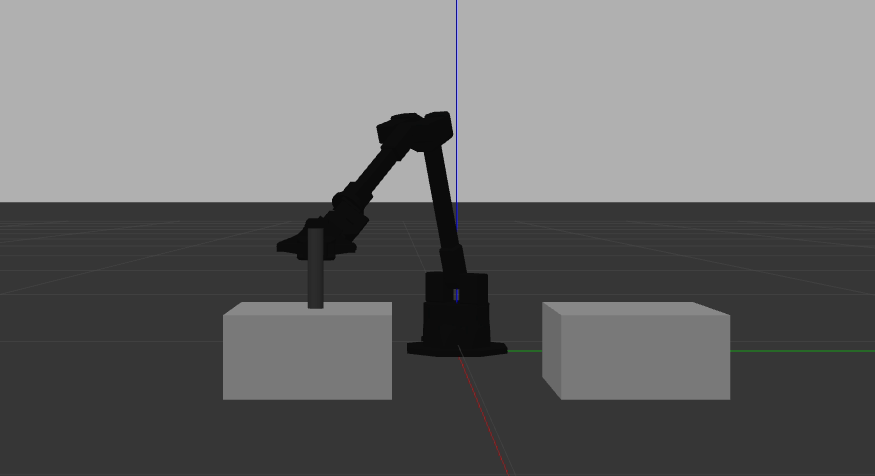

# Pick and Place utilizando o Braço Robótico WidowX-250s

Este repositório contém um tutorial para simulação de um simples pick and place utilizando o braço robótico WidowX-250s com o ROS (Robot Operating System). O objetivo deste projeto é permitir que o braço robótico mova um objeto de uma mesa para outra dentro de um ambiente simulado.



## Índice
- [Pré-requisitos](#pré-requisitos)
- [Instalação](#instalação)
- [Execução](#execução)


## Pré-requisitos

Antes de começar, certifique-se de que você tenha o seguinte instalado e configurado:

- [ROS Noetic](http://wiki.ros.org/noetic/Installation/Ubuntu) (Ubuntu 20.04)
- Python 3
- RViz e Gazebo (incluídos com a instalação do ROS)

## Instalação

1. Clone o repositório do braço robotico para o seu workspace ROS:

   Primeiro, faça o download dos pacotes fornecidos pela fabricante do braço robótico WidowX250s:
   ```bash
   cd ~/catkin_ws/src
   git clone https://github.com/Interbotix/interbotix_ros_manipulators.git
   cd ~/catkin_ws/src/interbotix_ros_manipulators/interbotix_ros_xsarms/
   rm CATKIN_IGNORE 
   cd ~/catkin_ws
   catkin_make
   source devel/setup.bash 
   
2. Clone o Repositório do Código Pick and Place para o seu Workspace ROS:

   Agora, faça o download deste repositório, que contém o código de pick and place:
   ```bash
   cd ~/catkin_ws/src
   git clone https://github.com/Aline-Gab/pick-and-place.git
   cd ~/catkin_ws
   catkin_make
   source devel/setup.bash

## Execução
Para executar o código de pick and place, siga os passos abaixo:

1. Inicie o ambiente de simulação:
   Abra um terminal e execute o comando a seguir para iniciar o ambiente de simulação:
   ```bash
   roslaunch interbotix_xsarm_pickplace xsarm_moveit.launch 

2. Execute o launch de pick and place:
   Abra um novo terminar e execute:
   ```bash
   roslaunch interbotix_xsarm_pickplace pickplace.launch
     

